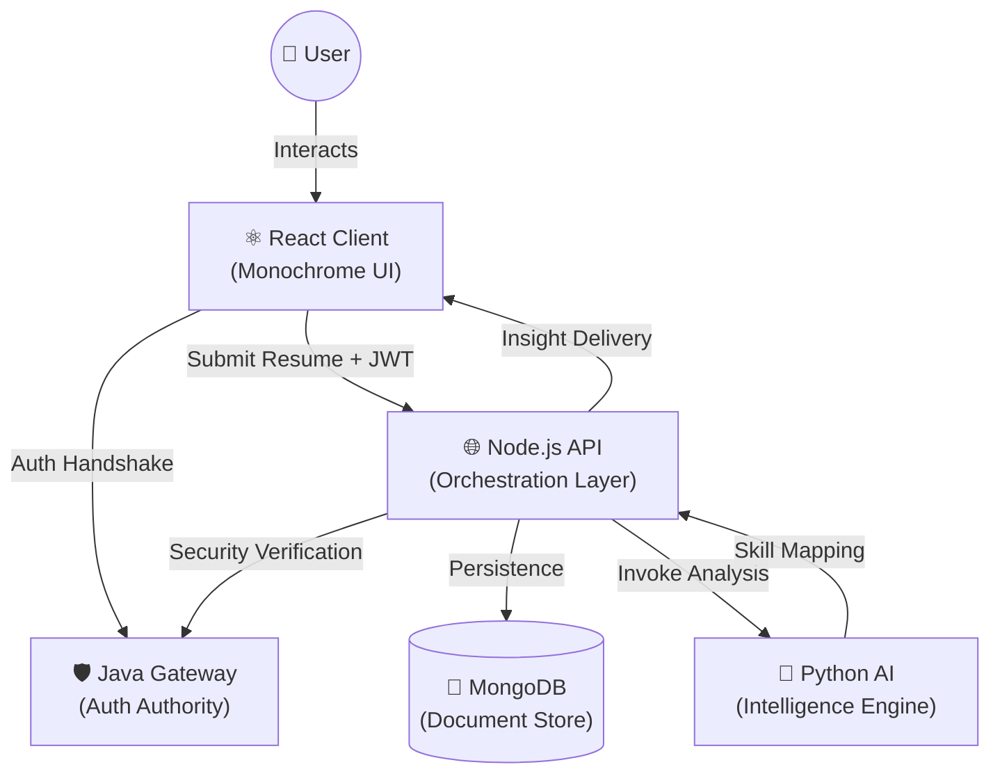

<div align="center">

<br/>


# Futrix AI 
### *Precision Career Intelligence — Powered by a Polyglot Microservices Architecture*

<br/>

[](https://react.dev)
[](https://www.typescriptlang.org)
[](https://vitejs.dev)
[](https://nodejs.org)
[](https://fastapi.tiangolo.com)
[](https://openjdk.org)
[](https://www.mongodb.com)

<br/>

> **Futrix AI** is a professional career intelligence platform that analyzes resumes with high-precision text-bounded NLP, maps skill gaps against industry demand, and architects personalized career growth strategies — all from the text you provide.

<br/>

[🚀 Quick Start](#-quick-start) · [🏗 Architecture](#-architecture) · [📂 Project Structure](#-project-structure) · [✨ Features](#-features) · [📊 Intelligence](#-intelligence-components)

<br/>

---

</div>

## 🛡️ Polyglot Engineering

A multi-language microservices architecture demonstrating how four distinct technology stacks collaborate in a secure, performance-oriented environment.

| Service       | Stack                          | Core Mission                                   |
|---------------|--------------------------------|------------------------------------------------|
| **🛡️ Java Gateway** | Java + Servlets + JJWT         | Distributed security, JWT issuance & validation |
| **🌐 Node API**    | Node.js + Express + Mongoose   | Business logic orchestrator & data persistence  |
| **🐍 Python AI**   | FastAPI + Regex NLP            | Text-bounded skill extraction, scoring & roadmap gen |
| **⚛️ React Client** | React 18 + TS + Framer Motion  | High-fidelity monochrome SaaS interface        |

<br/>

---

## 🏗 System Architecture

Futrix AI utilizes a sophisticated request-reply model with a shared security context.



<br/>

---

## ✨ Features

- **🖤 Monochrome SaaS Design** — A premium, high-contrast aesthetic utilizing `glassmorphism`, `backdrop-filters`, and a custom-tuned monochrome palette.
- **📄 Text-Bounded Resume Parsing** — Strict skill extraction using regex with word-boundary matching — only skills genuinely present in your text are detected. No hallucination.
- **📊 Dimensional Analysis** — Beyond simple counting; analyzes **Stack Balance**, **Cloud Presence**, **DevOps Readiness**, and **Language Diversity**.
- **🗺️ Context-Aware Roadmaps** — Personalized learning paths generated only from your identified skill gaps — no generic filler.
- **💼 Career Path Matching** — Role-based matching against a curated database with percentage-based fit analysis and salary ranges.
- **📁 Evolution Tracking** — Full history support and analysis comparison to track your growth over time.
- **🔐 Google OAuth + JWT Security** — Google Sign-In integration with JWT-based session management across all microservices.
- **🧠 170+ Skills Database** — Comprehensive detection covering languages, frameworks, cloud, DevOps, AI/ML, testing, and more.

<br/>

---

## 📊 Intelligence Components

The React client features a suite of custom-engineered data visualization components:

- **⚪ ScoreRing** — Real-time Career Readiness visualization.
- **🕸️ SkillRadar** — Multi-dimensional skill distribution plot.
- **🍩 GapDonut** — Precision visualization of technical debt (missing skills).
- **📉 ScoreArea** — Growth tracking over historical analysis points.
- **🔥 SkillHeatmap** — Intensity mapping of existing competencies.
- **📋 SuggestionPanel** — AI-driven actionable insights derived from your specific gaps.

<br/>

---

## 📂 Project Structure

```bash
futrix-ai/
├── 📁 client/             # React 18 frontend built with Vite & TypeScript
│   ├── 📁 layout/         # High-level architecture (AppShell, AuthLayout)
│   ├── 📁 pages/          # 12-screen intelligent dashboard ecosystem
│   ├── 📁 components/     # Visual intelligence, charts & FutrixLogo SVG
│   └── 📁 store/          # Global state (Auth, Analysis, UI)
├── 📁 node-api/           # Express backend orchestrator
│   ├── 📁 routes/         # RESTful endpoints for Analysis & Auth
│   ├── 📁 models/         # Mongoose schemas (User, Analysis)
│   └── 📁 middleware/     # JWT auth middleware
├── 📁 python-ai/          # FastAPI application for NLP logic
│   ├── ai_engine.py       # Text-bounded scoring & skill extraction
│   └── skills_db.json     # 170+ technology keywords database
└── 📁 java-gateway/       # Java-based security gateway
    └── src/               # Servlet-based auth & JWT controller
```

<br/>

---

## 🚀 Quick Start

### Prerequisites
- **Node.js** ≥ 18 · **Python** ≥ 3.9 · **Java** ≥ 11 + Maven · **MongoDB** running locally

### 1. Clone & Configure
```bash
git clone https://github.com/kirtan597/CareerTwin-AI.git
cd CareerTwin-AI
```

### 2. Environment Variables
```bash
# node-api/.env
cp node-api/.env.example node-api/.env
# Edit with your MongoDB URI and Google OAuth Client ID
```

### 3. Unified Launcher (Windows)
```powershell
.\run-dev.bat
```

### 4. Manual Startup (Cross-Platform)
```bash
# Gateway (Security)
cd java-gateway && mvn tomcat7:run

# API (Orchestrator)
cd node-api && npm install && node server.js

# AI Engine (Intelligence)
cd python-ai && pip install -r requirements.txt && uvicorn main:app --reload --port 8000

# Client (Interface)
cd client && npm install && npm run dev
```

### 5. Access
| Service | URL |
|---------|-----|
| Client | http://localhost:5173 |
| Node API | http://localhost:5000 |
| Python AI | http://localhost:8000 |
| Java Gateway | http://localhost:8080 |

<br/>

---

## 🔒 Authentication

Futrix AI supports two authentication methods:
- **Google OAuth 2.0** — Secure sign-in with Google (requires `GOOGLE_CLIENT_ID` in environment)
- **Email-based** — Quick access with email (magic-link style, no password required)

<br/>

---

## 🤝 Contributing

We welcome professional contributions that enhance the AI models or UI fidelity.

1. Fork the Project
2. Create your Feature Branch (`git checkout -b feature/AmazingFeature`)
3. Commit your Changes (`git commit -m 'Add some AmazingFeature'`)
4. Push to the Branch (`git push origin feature/AmazingFeature`)
5. Open a Pull Request

<br/>

---

<div align="center">

**Architecting the Future of Career Intelligence**

*Futrix AI — Data-driven transformation for the modern professional.*

</div>
