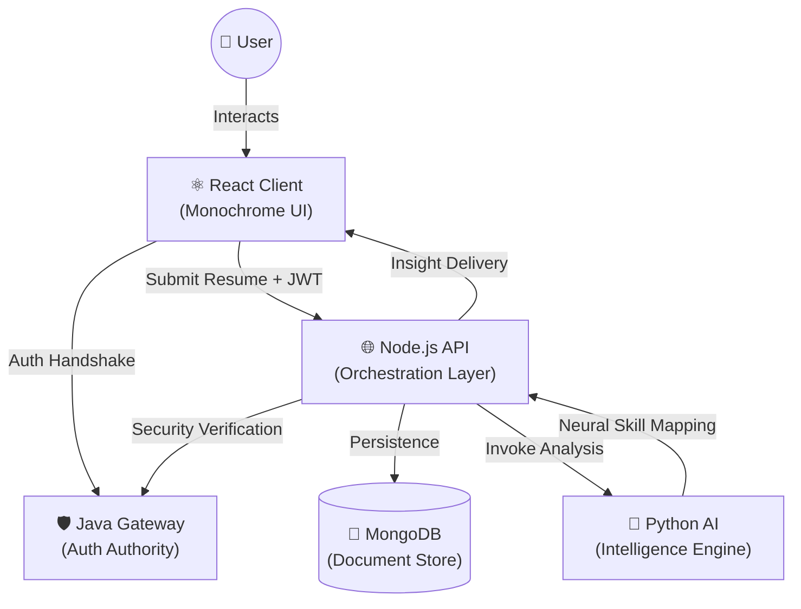

<div align="center">

<br/>


# CareerTwin AI 
### *Precision Career Intelligence — Powered by a Polyglot Microservices Architecture*

<br/>

[](https://react.dev)
[](https://www.typescriptlang.org)
[](https://vitejs.dev)
[](https://nodejs.org)
[](https://fastapi.tiangolo.com)
[](https://openjdk.org)
[](https://www.mongodb.com)

<br/>

> **CareerTwin AI** is a professional career intelligence platform that creates a digital twin of your professional persona. It leverages high-precision NLP to analyze resumes, map skill gaps, and architect personalized career growth strategies.

<br/>

[🚀 Quick Start](#-quick-start) · [🏗 Architecture](#-architecture) · [📂 Project Structure](#-project-structure) · [✨ Features](#-features) · [📊 Intelligence](#-intelligence-components)

<br/>

---

</div>

## 🛡️ Polyglot Engineering

This project is a masterclass in **multi-language microservices integration**, demonstrating how four distinct stacks can collaborate in a high-security, performance-oriented environment.

| Service       | Stack                          | Core Mission                                   |
|---------------|--------------------------------|------------------------------------------------|
| **🛡️ Java Gateway** | Java + Servlets + JJWT         | Distributed security, JWT issuance & validation |
| **🌐 Node API**    | Node.js + Express + Mongoose   | Business logic orchestrator & data persistence  |
| **🐍 Python AI**   | FastAPI + spaCy NLP            | NLP extraction, scoring heuristics & roadmap gen |
| **⚛️ React Client** | React 18 + TS + Framer Motion  | High-fidelity monochrome SaaS interface        |

<br/>

---

## 🏗 System Architecture

CareerTwin AI utilizes a sophisticated request-reply model with a shared security context.



<br/>

---

## ✨ Features

- **🖤 Monochrome SaaS Design** — A premium, high-contrast aesthetic utilizing `glassmorphism`, `backdrop-filters`, and a custom-tuned monochrome palette.
- **📄 Neural Resume Parsing** — Advanced skill extraction using **spaCy's** industry-standard NLP models.
- **📊 Dimensional Analysis** — Beyond simple counting; we analyze **Stack Balance**, **Cloud Presence**, and **DevOps Readiness**.
- **🗺️ Strategic Roadmaps** — Personalized, step-by-step learning paths automatically generated to bridge identified gaps.
- **💼 Market Job Matching** — Real-time matching against a curated database of roles with percentage-based fit analysis.
- **📁 Evolution Tracking** — Full history support and analysis comparison to track your growth over time.
- **🔐 Hardened Security** — Java-based JWT gateway ensuring enterprise-grade protection across all microservices.

<br/>

---

## 📊 Intelligence Components

The React client features a suite of custom-engineered data visualization components centered on user growth:

- **⚪ ScoreRing** — Real-time Career Readiness visualization.
- **🕸️ SkillRadar** — Multi-dimensional skill distribution plot.
- **🍩 GapDonut** — Precision visualization of technical debt (missing skills).
- **📉 ScoreArea** — Growth tracking over historical analysis points.
- **🔥 SkillHeatmap** — Intensity mapping of existing competencies.
- **📋 SuggestionPanel** — AI-driven actionable insights and next-steps.

<br/>

---

## 📂 Project Structure

```bash
career-twin-ai/
├── 📁 client/             # React 18 frontend built with Vite & TypeScript
│   ├── 📁 layout/         # High-level architecture (AppShell, AuthLayout)
│   ├── 📁 pages/          # 12-screen intelligent dashboard ecosystem
│   ├── 📁 components/     # Visual intelligence & chart components
│   └── 📁 store/          # Global state (Auth, Analysis, UI)
├── 📁 node-api/           # Express backend orchestrator
│   ├── 📁 routes/         # RESTful endpoints for Analysis & Matchmaking
│   └── 📁 models/         # Mongoose schemas for persistence
├── 📁 python-ai/          # FastAPI application for NLP logic
│   └── ai_engine.py       # Scoring algorithms & skill extraction
└── 📁 java-gateway/       # Java-based security gateway
    └── src/               # Servlet-based auth & JWT controller
```

<br/>

---

## 🚀 Quick Start

### 1. Unified Launcher (Windows)
We provide a one-click development launcher:
```powershell
.\run-dev.bat
```

### 2. Manual Startup (Cross-Platform)
```bash
# Gateway (Security)
cd java-gateway && mvn tomcat7:run

# API (Orchestrator)
cd node-api && npm start

# AI Engine (Intelligence)
cd python-ai && uvicorn main:app --reload --port 8000

# Client (Interface)
cd client && npm run dev
```

<br/>

---

## 🤝 Contributing

We welcome professional contributions that enhance the AI models or UI fidelity.

1. Fork the Project
2. Create your Feature Branch (`git checkout -b feature/AmazingFeature`)
3. Commit your Changes (`git commit -m 'Add some AmazingFeature'`)
4. Push to the Branch (`git push origin feature/AmazingFeature`)
5. Open a Pull Request

<br/>

---

<div align="center">

**Architecting the Future of Career Intelligence**

*CareerTwin AI — Data-driven transformation for the modern professional.*

</div>
