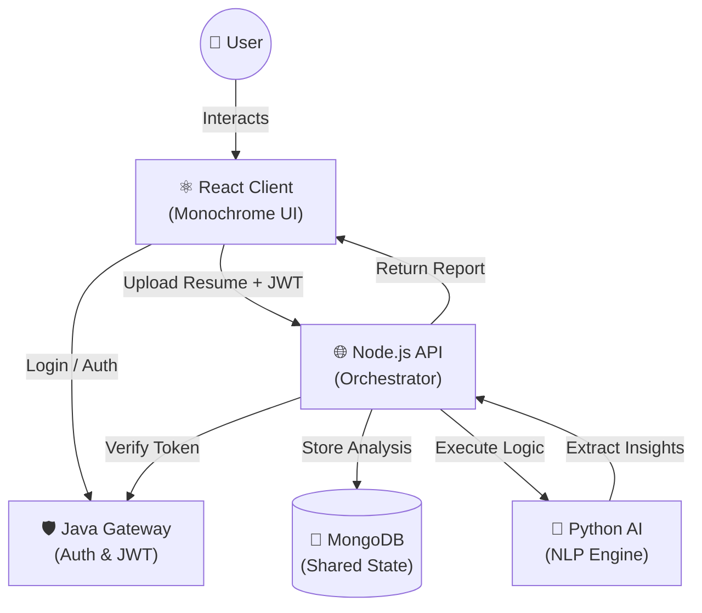

<div align="center">

<br/>


# CareerTwin AI 
### *Precision Career Intelligence — Powered by a Polyglot Microservices Architecture*

<br/>

[](https://react.dev)
[](https://www.typescriptlang.org)
[](https://vitejs.dev)
[](https://nodejs.org)
[](https://fastapi.tiangolo.com)
[](https://openjdk.org)
[](https://www.mongodb.com)

<br/>

> **CareerTwin AI** is a premium career intelligence platform that analyzes your professional profile using advanced NLP, identifies market skill gaps, and generates a personalized learning roadmap. Engineered with a sophisticated **Polyglot Architecture**, it demonstrates seamless integration across four distinct technology stacks.

<br/>

[🚀 Quick Start](#-quick-start) · [🏗 Architecture](#-architecture) · [📂 Project Structure](#-project-structure) · [✨ Features](#-features) · [🐳 Docker](#-running-with-docker)

<br/>

---

</div>

## 🛡️ The Polyglot Core

CareerTwin AI is built on a distributed microservices model, leveraging the unique strengths of different ecosystems to provide a high-performance, secure, and intelligent experience.

| Service       | Stack                          | Responsibility                                 |
|---------------|--------------------------------|------------------------------------------------|
| **🛡️ Java Gateway** | Java + Servlets + JWT          | Enterprise-grade Security & Auth Orchestration |
| **🌐 Node API**    | Node.js + Express + Mongoose   | API Orchestration, Persistence & Job Matching  |
| **🐍 Python AI**   | FastAPI + spaCy NLP            | Skill Extraction, Gap Analysis & Roadmap Gen   |
| **⚛️ React Client** | React 18 + TS + MUI           | Premium Monochrome SaaS UI / UX                |

<br/>

---

## 🏗 Architecture & Flow

The system employs a layered communication protocol ensuring data integrity and security at every hop.



<br/>

---

## ✨ Features

- **🖤 Monochrome SaaS Aesthetic** — A professional, high-end design system using glassmorphism, subtle micro-animations, and a precision-tailored dark theme.
- **📄 AI-Powered Analysis** — Deep NLP extraction using spaCy to parse technical and soft skills from raw resume text.
- **📊 Precision Scoring** — Multi-dimensional Career Readiness Score based on skill density, stack balance, and cloud/DevOps presence.
- **🗺️ Learning Roadmap** — Dynamic, step-by-step roadmap generation to bridge identified gaps and achieve career milestones.
- **💼 Job Match Intelligence** — Matching your unique skill profile against current industry roles with percentage-based fit analysis.
- **📁 History & Comparison** — Track your professional evolution over time and compare different resume versions to see your growth.
- **🔐 Enterprise Auth** — Stateless JWT authentication issued by the Java Gateway and globally enforced across services.

<br/>

---

## 📂 Project Structure

```
career-twin-ai/
│
├── 📁 client/                # React 18 + Vite + TypeScript (Monochrome UI)
│   ├── src/
│   │   ├── layout/           # AppShell & AuthLayout components
│   │   ├── pages/            # 12-screen dashboard architecture
│   │   ├── components/       # Custom data cards & visualizations
│   │   ├── store/            # Auth & Analysis state management
│   │   └── theme.ts          # Custom Monochrome Design System
│
├── 📁 node-api/              # Node.js + Express + Mongoose
│   ├── routes/               # Analysis, History, Comparison, & Job Matchers
│   ├── models/               # MongoDB Schemas (User, Analysis)
│   └── middleware/           # JWT Security Guards
│
├── 📁 python-ai/             # FastAPI + spaCy NLP Engine
│   ├── ai_engine.py          # Extraction, Scoring, & Roadmap logic
│   └── main.py              # Async API Endpoints
│
├── 📁 java-gateway/          # Java Auth Gateway
│   └── src/                  # Servlet-based Security & JWT Generation
│
└── 🐳 docker-compose.yml     # Full-stack container orchestration
```

<br/>

---

## 🚀 Quick Start

### 1. Clone & Setup
```bash
git clone https://github.com/kirtan597/CareerTwin-AI.git
cd career-twin-ai
```

### 2. Automated Launcher (Windows)
Double-click `run-dev.bat` to launch all 4 services in parallel.

### 3. Manual Start (Cross-Platform)
```bash
# Terminal 1: Java Gateway
cd java-gateway && mvn tomcat7:run

# Terminal 2: Node.js API
cd node-api && npm start

# Terminal 3: Python AI
cd python-ai && uvicorn main:app --reload --port 8000

# Terminal 4: React Client
cd client && npm run dev
```

<br/>

---

## 🤝 Contributing

We welcome contributions that push the boundaries of career intelligence!

1. Fork the Project
2. Create your Feature Branch (`git checkout -b feature/AmazingFeature`)
3. Commit your Changes (`git commit -m 'Add some AmazingFeature'`)
4. Push to the Branch (`git push origin feature/AmazingFeature`)
5. Open a Pull Request

<br/>

---

<div align="center">

**Built with Precision for the Modern Professional**

*CareerTwin AI — Transform your resume into a strategic advantage*

</div>
