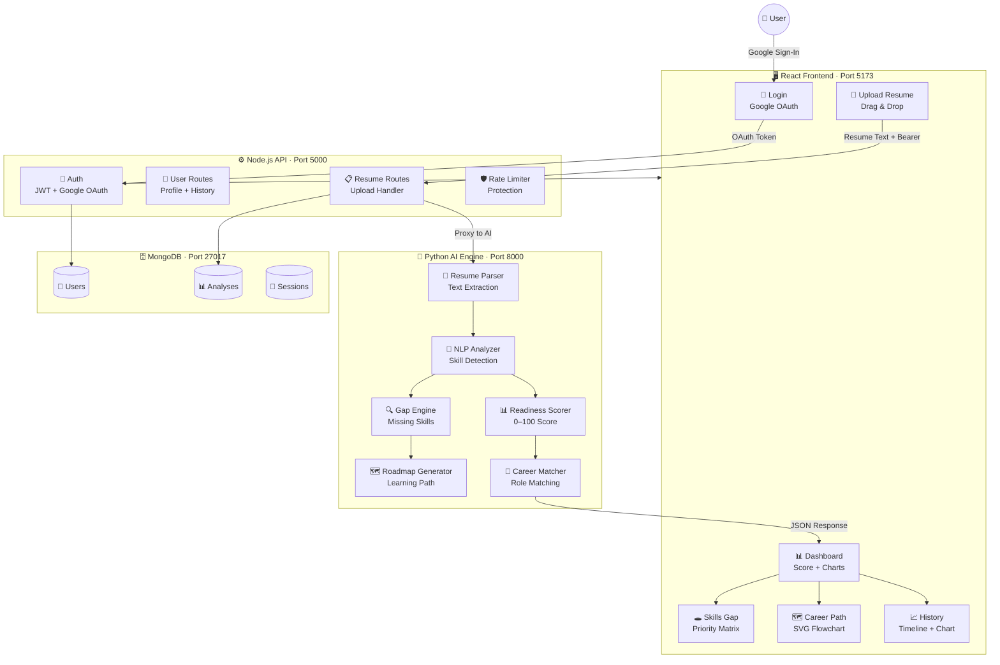
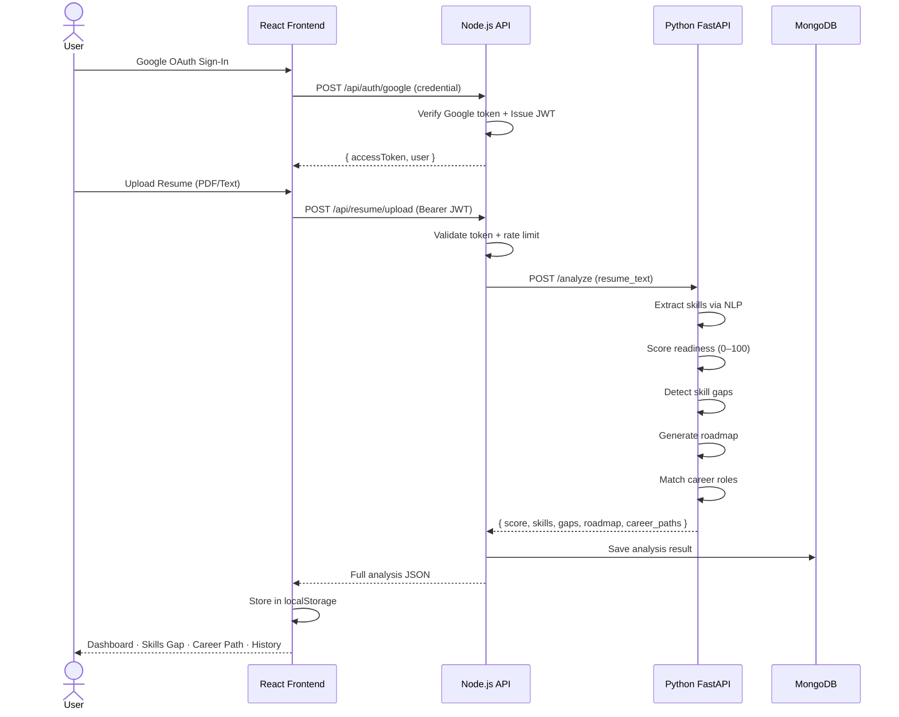
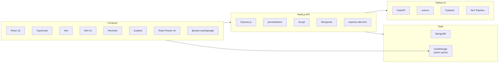
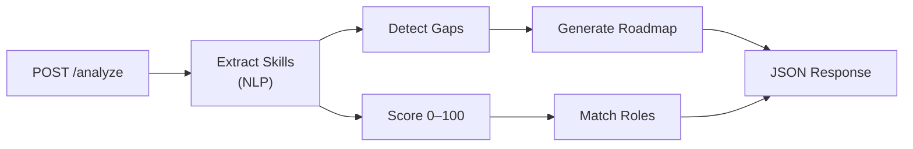

<div align="center">

<br />


<br /><br />

# FUTRIX AI

### *Your Resume. Decoded by AI. Mapped to Your Future.*

<br />

[](https://react.dev)
[](https://typescriptlang.org)
[](https://fastapi.tiangolo.com)
[](https://nodejs.org)
[](https://mongodb.com)
[](https://mui.com)

<br />

[](LICENSE)
[](https://github.com/kirtan597/Futrix-Ai/pulls)
[](https://github.com/kirtan597/Futrix-Ai)

<br />

> **90% of job seekers get rejected not because they lack skills — but because they don't know which skills matter.**
>
> Futrix AI changes that.

<br />

</div>

---

## 🎯 The Problem We're Solving

The modern job market is broken for candidates:

- 📄 **Blind resume writing** — People craft resumes without knowing what ATS systems and hiring managers actually look for
- 🕳️ **Hidden skill gaps** — Candidates don't know *which specific skills* are holding them back from their target role
- 🗺️ **No personalized roadmap** — Generic career advice ignores your actual starting point and target destination
- 📊 **Zero feedback loop** — After rejection, candidates have no way to measure progress or know what to improve

**Futrix AI is the career intelligence layer that sits between you and your next role** — parsing your resume with NLP, scoring your readiness, surfacing exact gaps, and building a step-by-step learning roadmap tailored specifically to you.

---

## 🏗️ System Architecture



---

## 🔄 Data Flow — Resume to Insights



---

## ✨ Feature Showcase

### 📊 Intelligence Dashboard

<table>
<tr>
<td width="50%">

**Score Ring**
- Animated SVG circular progress
- Grade: Excellent / Good / Fair / Developing
- Glow filter for premium feel

</td>
<td width="50%">

**Skill Radar Chart**
- Detected skills vs gap skills overlay
- Recharts RadarChart with polygon grid
- Proficiency scoring per skill

</td>
</tr>
<tr>
<td>

**Gap Donut Chart**
- Skills you have vs gaps visual split
- Recharts PieChart with custom label
- Instant readability at a glance

</td>
<td>

**Score Area Chart**
- Career progress over time
- Recharts AreaChart with gradient fill
- Reference line at target score (60)

</td>
</tr>
</table>

---

### 🕳️ Skills Gap Intelligence

```
┌─────────────────────────────────────────────────────────┐
│                  Impact vs Effort Matrix                 │
│                                                         │
│  HIGH  │  Docker ●   │  Kubernetes ●  │               │
│        │  TypeScript ●│  AWS ●         │  STRETCH      │
│ IMPACT ├─────────────┼────────────────┤               │
│        │  Redis ●    │  Go ●          │               │
│  LOW   │             │                │  LOW PRIORITY │
│        └─────────────┴────────────────┘               │
│              LOW           HIGH                         │
│                        EFFORT                           │
└─────────────────────────────────────────────────────────┘
```

- **Priority Matrix** — 2×2 SVG quadrant: Impact vs Effort → tells you exactly what to learn *first*
- **Animated Severity Bars** — Gap skills ranked by career impact with color-coded priority (critical / high / medium)
- **Distribution Bar Chart** — Your skill profile breakdown at a glance
- **Course Recommendations** — Every gap linked to a free/paid learning resource

---

### 🗺️ Career Path Flowchart

```
         ┌─────────────────────────────┐
         │  01  Learn Docker basics    │  ← Step 1 (glow)
         └──────────────┬──────────────┘
                        ▼ (dashed connector)
         ┌─────────────────────────────┐
         │  02  Complete Kubernetes    │
         │      fundamentals           │
         └──────────────┬──────────────┘
                        ▼
         ┌─────────────────────────────┐
         │  03  Build a CI/CD pipeline │
         └──────────────┬──────────────┘
                        ▼
                      ...
```

- **SVG Tech-Tree Flowchart** — Step-by-step nodes with animated dashed connectors
- **Role Match Cards** — Live skill matching with mini score rings showing your % match
- **AI Career Paths** — Python AI returns personalized role suggestions with salary ranges
- **Salary Intelligence** — Real market ranges per role matched to your profile

---

### 📈 Progress History Timeline

```
 ●84 ─ Analysis #4  Apr 29, 2026  [Latest]         ↑ +12 pts
  │    ████████████████████████████████████ 84/100
  │    Skills: Python, TypeScript, React, Node.js…  Gaps: Kubernetes, AWS

 ○72 ─ Analysis #3  Apr 10, 2026                   ↑ +18 pts
  │    █████████████████████████████        72/100
  │    Skills: React, TypeScript, Node.js…  Gaps: Kubernetes, AWS, GraphQL

 ○54 ─ Analysis #2  Mar 22, 2026                   ↑ +16 pts
       ████████████████████████         54/100
       Skills: React, JavaScript…  Gaps: TypeScript, Docker, MongoDB
```

- **Area Chart Trajectory** — See your readiness score grow over time
- **Mini Score Rings** — SVG rings on every timeline node show score at a glance
- **Delta Badges** — Green/red trend arrows show pts gained between analyses
- **Progress Bars** — Per-entry score bar for instant comparison

---

## 🛠️ Tech Stack



---

## 📁 Project Structure

```
futrix-ai/
│
├── 📱 client/                    # React 18 + TypeScript + Vite
│   ├── public/
│   │   └── logo.svg              # Futrix AI SVG logo + favicon
│   ├── src/
│   │   ├── components/
│   │   │   ├── Sidebar.tsx       # Responsive sidebar + mobile drawer
│   │   │   ├── ScoreRing.tsx     # Animated SVG circular progress
│   │   │   └── charts/
│   │   │       ├── SkillRadar.tsx    # Recharts radar chart
│   │   │       ├── GapDonut.tsx      # Recharts donut chart
│   │   │       ├── ScoreArea.tsx     # Recharts area chart
│   │   │       └── FunnelBar.tsx     # Recharts bar chart
│   │   ├── pages/
│   │   │   ├── Login.tsx         # Spiral canvas + Google OAuth
│   │   │   ├── Dashboard.tsx     # Score ring + charts grid
│   │   │   ├── UploadResume.tsx  # Drag-and-drop + analyzing overlay
│   │   │   ├── Result.tsx        # Full AI analysis view
│   │   │   ├── SkillsGap.tsx     # Priority matrix + severity bars
│   │   │   ├── CareerPath.tsx    # SVG flowchart + role cards
│   │   │   ├── History.tsx       # Area chart + timeline
│   │   │   └── Profile.tsx       # User profile + session
│   │   ├── store/
│   │   │   └── authStore.ts      # Zustand auth state
│   │   ├── services/
│   │   │   └── apiService.ts     # Axios wrapper + token handling
│   │   ├── App.tsx               # Routes + AppShell + ProtectedRoute
│   │   ├── theme.ts              # MUI dark theme design system
│   │   └── index.css             # Global CSS + mobile resets
│   ├── index.html                # PWA meta + viewport-fit=cover
│   └── vite.config.ts            # Proxy + COOP config
│
├── ⚙️ node-api/                   # Node.js + Express REST API
│   ├── middleware/
│   │   ├── auth.js               # JWT verification middleware
│   │   └── rateLimiter.js        # Express rate limiting
│   ├── models/
│   │   └── User.js               # Mongoose user schema
│   ├── routes/
│   │   ├── authRoutes.js         # Google OAuth + JWT issue
│   │   └── userRoutes.js         # Profile + analysis history
│   └── server.js                 # Express app + MongoDB connect
│
├── 🐍 python-ai/                  # FastAPI AI Engine
│   ├── main.py                   # FastAPI app + all endpoints
│   └── requirements.txt          # fastapi, uvicorn, pydantic
│
├── ☕ java-gateway/               # Spring Boot API Gateway (optional)
│   ├── src/
│   ├── pom.xml
│   └── Dockerfile
│
├── 🚀 run-dev.bat                 # One-command: start all 4 services
├── start-dev.bat                  # Alternative start with health checks
├── setup.bat                      # First-time dependency installer
├── health-check.js                # Service health monitor
├── validate-env.js                # Environment config validator
├── docker-compose.yml             # Docker multi-service setup
└── netlify.toml                   # Netlify SPA + redirect config
```

---

## 🚀 Quick Start

### Prerequisites

| Requirement | Version |
|---|---|
| Node.js | 18+ |
| Python | 3.10+ |
| MongoDB | Running locally |
| Git | Latest |

### 1 — Clone

```bash
git clone https://github.com/kirtan597/Futrix-Ai.git
cd Futrix-Ai
```

### 2 — Setup (First Time)

```bash
# Auto-installs all dependencies
.\setup.bat
```

Or manually:

```bash
cd client && npm install && cd ..
cd node-api && npm install && cd ..
cd python-ai && pip install -r requirements.txt && cd ..
```

### 3 — Environment Variables

**`node-api/.env`**
```env
PORT=5000
MONGO_URI=mongodb://localhost:27017/futrixai
JWT_SECRET=<generate_64_char_hex>
GOOGLE_CLIENT_ID=<your_google_client_id>
GOOGLE_CLIENT_SECRET=<your_google_client_secret>
FRONTEND_URL=http://localhost:5173
```

**`client/.env`**
```env
VITE_GOOGLE_CLIENT_ID=<your_google_client_id>
VITE_API_URL=http://localhost:5000
```

> 🔑 Get your Google Client ID from [Google Cloud Console](https://console.cloud.google.com/) → APIs & Services → Credentials → OAuth 2.0 Client IDs
> Add `http://localhost:5173` as an Authorized JavaScript Origin.

### 4 — Launch

```bash
.\run-dev.bat
```

| Service | URL | Status |
|---|---|---|
| 🖥️ Frontend | http://localhost:5173 | React + Vite |
| ⚙️ Node API | http://localhost:5000 | Express + JWT |
| 🐍 Python AI | http://localhost:8000 | FastAPI + uvicorn |
| 🗄️ MongoDB | localhost:27017 | Database |

---

## 📡 API Reference

### Python AI — `http://localhost:8000`



**`POST /analyze`**

```json
// Request
{ "resume_text": "Full resume text here..." }

// Response
{
  "readiness_score": 84,
  "skills": ["React", "TypeScript", "Node.js", "Python", "MongoDB"],
  "gap_skills": ["Kubernetes", "AWS", "GraphQL"],
  "roadmap": [
    "Master Docker containerization",
    "Complete Kubernetes for Beginners",
    "Deploy on AWS EC2 + S3"
  ],
  "career_paths": [
    {
      "role": "Full Stack Developer",
      "match_percent": 82,
      "salary_range": "$90k–$145k",
      "skills_needed": ["React", "Node.js", "MongoDB", "Docker"],
      "matched_skills": ["React", "Node.js", "MongoDB"],
      "missing_skills": ["Docker"]
    }
  ]
}
```

| Endpoint | Method | Description |
|---|---|---|
| `/` | GET | Health check — engine version |
| `/analyze` | POST | Full resume analysis |
| `/score-breakdown` | POST | Detailed scoring per category |
| `/career-path` | POST | Role match analysis only |
| `/compare` | POST | Compare two resumes |

### Node API — `http://localhost:5000`

| Endpoint | Method | Auth | Description |
|---|---|---|---|
| `GET /health` | GET | — | Server health |
| `POST /api/auth/google` | POST | — | Exchange Google credential for JWT |
| `GET /api/auth/verify` | GET | Bearer | Verify JWT token |
| `GET /api/user/profile` | GET | Bearer | Get user profile |
| `POST /api/resume/upload` | POST | Bearer | Upload + analyze resume |

---

## 📱 Mobile Experience

Futrix AI is fully mobile-responsive:

```
Mobile (< 600px)              Desktop (> 900px)
┌─────────────────┐           ┌────┬─────────────────────┐
│ ☰  Futrix AI   │           │    │                     │
├─────────────────┤           │ S  │   Dashboard         │
│                 │           │ I  │                     │
│   Page Content  │           │ D  │   Score Ring        │
│                 │           │ E  │   Charts Grid       │
│                 │           │ B  │                     │
│                 │           │ A  │                     │
├─────────────────┤           │ R  │                     │
│ 🏠  📄  📊  👤 │           │    │                     │
│ Bottom Nav Bar  │           └────┴─────────────────────┘
└─────────────────┘
```

- **Bottom navigation bar** — Home, Upload, Results, Gaps, Profile (always visible)
- **Slide-out drawer** — Full menu accessible via hamburger
- **44px touch targets** — WCAG-compliant touch areas throughout
- **PWA-ready** — `viewport-fit=cover`, iOS safe-area insets, theme-color meta

---

## 🎨 Design System

Futrix AI uses a **premium monochrome SaaS aesthetic**:

| Token | Value | Usage |
|---|---|---|
| Background | `#0a0a0a` | Page backgrounds |
| Surface | `rgba(255,255,255,0.025)` | Glass cards |
| Border | `rgba(255,255,255,0.065)` | Card borders |
| Text Primary | `#ffffff` | Headings |
| Text Secondary | `rgba(255,255,255,0.4)` | Labels |
| Critical | `rgba(248,113,113,0.85)` | Critical gaps |
| High | `rgba(251,191,36,0.85)` | High priority |
| Medium | `rgba(148,163,184,0.7)` | Medium priority |
| Positive | `rgba(134,239,172,0.85)` | Growth / success |

**Typography:** Inter (Google Fonts) · **Radius:** 12–18px · **Animation:** `cubic-bezier(0.4,0,0.2,1)`

---

## 🚢 Deployment

### Frontend → Netlify

`netlify.toml` is pre-configured:

```toml
[build]
  base    = "client"
  command = "npm run build"
  publish = "dist"

[[redirects]]
  from = "/*"
  to   = "/index.html"
  status = 200
```

Set these in Netlify dashboard → Environment variables:
```
VITE_GOOGLE_CLIENT_ID = your_client_id
VITE_API_URL = https://your-node-api.railway.app
```

### Python AI → Railway / Render

```bash
pip install -r requirements.txt
uvicorn main:app --host 0.0.0.0 --port 8000
```

### Node API → Railway / Render

```bash
npm install
npm start
```

### Docker (All services)

```bash
docker-compose up --build
```

---

## 🔐 Security

- **JWT** — 64-character random hex secret, short expiry
- **Google OAuth 2.0** — Server-side token verification via Google API
- **Rate Limiting** — `express-rate-limit` on all auth endpoints
- **CORS** — Strict origin allowlist (localhost + production domain only)
- **Token Storage** — `accessToken` in `localStorage`, refreshed on expiry
- **Input Validation** — Pydantic models on all Python AI endpoints

---

## 🗺️ Roadmap

- [ ] PDF parsing (currently text-based)
- [ ] ATS score simulation (beat the bots)
- [ ] LinkedIn profile import
- [ ] Multi-language resume support
- [ ] Job posting URL → instant gap analysis
- [ ] Interview prep module (AI-generated questions based on gaps)
- [ ] Weekly progress email reports
- [ ] Resume builder with gap-aware suggestions

---

## 🤝 Contributing

```bash
# Fork the repo, then:
git checkout -b feat/your-feature
git commit -m "feat: your awesome feature"
git push origin feat/your-feature
# Open a Pull Request
```

---

## 📄 License

MIT License — free to use, fork, modify, and distribute.

---

<div align="center">

<br />

**Futrix AI** · Built by [Kirtann](https://github.com/kirtan597) · v2.0 · 2026

*From resume to roadmap — in seconds.*

<br />

⭐ If this project helped you, consider giving it a star!

</div>
