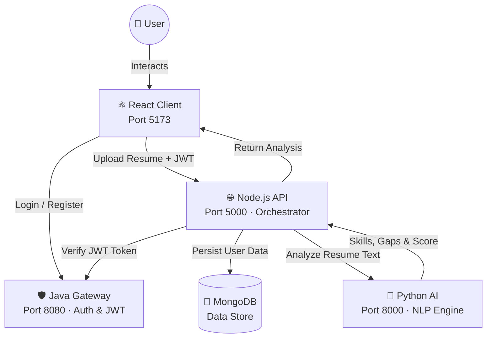

<div align="center">

<br/>


# CareerTwin AI

### *Your Intelligent Digital Career Twin — Powered by a Polyglot Microservices Architecture*

<br/>

[](https://react.dev)
[](https://www.typescriptlang.org)
[](https://vitejs.dev)
[](https://nodejs.org)
[](https://fastapi.tiangolo.com)
[](https://openjdk.org)
[](https://www.mongodb.com)
[](https://docs.docker.com/compose)

<br/>

> **CareerTwin AI** analyzes your resume using NLP, identifies your existing skills, detects market skill gaps, and generates a personalized learning roadmap — all backed by a production-grade, multi-language microservices architecture.

<br/>

[🚀 Quick Start](#-quick-start) · [🏗 Architecture](#-architecture) · [📂 Project Structure](#-project-structure) · [✨ Features](#-features) · [🐳 Docker](#-running-with-docker)

<br/>

---

</div>

## 🌟 What is CareerTwin AI?

**CareerTwin AI** is a full-stack career intelligence platform that creates a **digital twin** of your professional profile. Simply upload your resume text and the platform:

- 🧠 **Extracts your skills** using spaCy NLP
- 📊 **Identifies skill gaps** by comparing against a curated market skills database
- 🗺️ **Generates a personalized roadmap** to guide your career growth
- 📈 **Calculates a Career Readiness Score** based on your profile

What sets this project apart is its **Polyglot Architecture** — four different technology stacks working in harmony, demonstrating real-world enterprise-grade service integration:

| Service       | Technology Stack              | Responsibility                     |
|---------------|-------------------------------|------------------------------------|
| 🛡️ Java Gateway | Java + Servlets + Maven + JWT | Security, Authentication, Session  |
| 🌐 Node API    | Node.js + Express + Mongoose  | Orchestration, Business Logic      |
| 🐍 Python AI   | FastAPI + spaCy               | NLP Resume Parsing, Gap Analysis   |
| ⚛️ React Client | React + TypeScript + Vite + MUI | Premium Frontend Experience     |

<br/>

---

## 🏗 Architecture

The system follows a clean, layered communication model:

```
User → React Client → Java Gateway (Auth) → Node.js API → Python AI Engine
                                          ↕
                                       MongoDB
```



<br/>

---

## ✨ Features

- **🔐 JWT Authentication** — Secure, stateless auth issued by the Java Gateway and verified by Node.js before every protected request.
- **📄 AI Resume Parsing** — The Python AI engine uses spaCy NLP to extract skills like `React`, `Docker`, `MongoDB`, `Python`, and more from raw resume text.
- **📊 Skill Gap Analysis** — Compares extracted skills against a curated market skills database to surface what you're missing.
- **🗺️ Learning Roadmap** — Generates a step-by-step, personalized action plan to bridge identified skill gaps.
- **📈 Career Readiness Score** — A 0–100 score calculated from the ratio of matched vs. market-standard skills.
- **🎨 Premium Ocean UI** — Dark-mode glassmorphism design with smooth animations, MUI components, and a white + ocean-blue palette — no Tailwind dependency.
- **🐳 Docker Ready** — Each service ships with a `Dockerfile` and a root `docker-compose.yml` for one-command deployment.

<br/>

---

## 📂 Project Structure

```
career-twin-ai/
│
├── 📁 client/                     # Frontend — React + Vite + TypeScript
│   ├── src/
│   │   ├── pages/
│   │   │   ├── Login.tsx          # Auth page (register / login)
│   │   │   ├── UploadResume.tsx   # Resume text input & submission
│   │   │   └── Dashboard.tsx      # Career Intelligence Report UI
│   │   ├── App.tsx                # Router, Navbar, Protected Routes
│   │   ├── theme.ts               # MUI custom ocean-blue theme
│   │   └── index.css              # Global styles & CSS tokens
│   ├── index.html
│   └── package.json
│
├── 📁 node-api/                   # Backend — Express + Mongoose
│   ├── controllers/               # Request handler logic
│   ├── middleware/                # JWT auth verification middleware
│   ├── models/                    # Mongoose schemas (User, etc.)
│   ├── routes/                    # API route definitions
│   ├── services/                  # Business logic & Python AI proxy
│   ├── server.js                  # Express server entry point
│   ├── .env.example               # Environment variable template
│   └── Dockerfile
│
├── 📁 python-ai/                  # AI Engine — FastAPI + spaCy
│   ├── ai_engine.py               # NLP logic, skills DB, gap analysis
│   ├── main.py                    # FastAPI app & route definitions
│   ├── skills_db.json             # Curated market skills database
│   ├── requirements.txt           # Python dependencies
│   └── Dockerfile
│
├── 📁 java-gateway/               # Auth Gateway — Java + Servlets + Maven
│   ├── src/main/java/             # LoginServlet, JwtUtil, AuthFilter
│   ├── pom.xml                    # Maven dependencies (JWT, Javax Servlet)
│   └── Dockerfile
│
├── docker-compose.yml             # One-command full-stack deployment
├── run-dev.bat                    # Windows one-click dev launcher
└── run-dev.ps1                    # PowerShell one-click dev launcher
```

<br/>

---

## 🚀 Quick Start

### Prerequisites

Make sure you have the following installed:

| Tool | Minimum Version | Purpose |
|------|----------------|---------|
| [Node.js](https://nodejs.org) | v16+ | Client & Node API |
| [Python](https://www.python.org) | v3.9+ | AI Engine |
| [Java JDK](https://openjdk.org) | v17+ | Java Gateway |
| [Maven](https://maven.apache.org) | v3.8+ | Java build tool |
| [MongoDB](https://www.mongodb.com) | v5+ | Database (local or Atlas) |

<br/>

### 1. Clone the Repository

```bash
git clone https://github.com/your-username/career-twin-ai.git
cd career-twin-ai
```

### 2. Configure Environment

Copy and fill in the Node API environment file:

```bash
cd node-api
cp .env.example .env
```

Open `.env` and set your MongoDB URI:

```env
MONGO_URI=mongodb://localhost:27017/careertwin
JWT_SECRET=your_super_secret_key
PORT=5000
```

### 3. Install Dependencies

Run these commands **once** from the root `career-twin-ai/` directory:

```bash
# React Client
cd client && npm install && cd ..

# Node.js API
cd node-api && npm install && cd ..

# Python AI Engine
cd python-ai && pip install -r requirements.txt
python -m spacy download en_core_web_sm && cd ..
```

### 4. Start All Services

#### Option A — One Click (Windows)

Double-click **`run-dev.bat`** or run from PowerShell:

```powershell
.\run-dev.bat
```

This opens **4 terminal windows**, one for each service.

#### Option B — Manual (Cross-Platform)

Open 4 separate terminals and run each of the following:

```bash
# Terminal 1 — Java Gateway (Auth)
cd java-gateway
mvn tomcat7:run

# Terminal 2 — Node.js API (Backend)
cd node-api
npm start

# Terminal 3 — Python AI (Intelligence)
cd python-ai
uvicorn main:app --reload --port 8000

# Terminal 4 — React Client (Frontend)
cd client
npm run dev
```

### 5. Open the App

| Service | URL |
|---------|-----|
| ⚛️ React Frontend | http://localhost:5173 |
| 🌐 Node.js API | http://localhost:5000 |
| 🐍 Python AI | http://localhost:8000 |
| 🛡️ Java Gateway | http://localhost:8080/careertwin |

<br/>

---

## 🐳 Running with Docker

Spin up the entire platform with a single command using Docker Compose:

```bash
# From the career-twin-ai/ root directory
docker-compose up --build
```

All services (client, node-api, python-ai, java-gateway) will be orchestrated automatically with the correct networking and port bindings.

To stop all services:

```bash
docker-compose down
```

<br/>

---

## 🔄 Application Flow

```
1. User registers / logs in    → Java Gateway issues a signed JWT
2. Token stored in client      → localStorage (used for all further requests)
3. User uploads resume text    → React sends POST /api/analyze with JWT in header
4. Node API verifies JWT       → Forwards token to Java Gateway for validation
5. Analysis request sent       → Node API proxies resume text to Python FastAPI
6. Python AI processes text    → spaCy NLP extracts skills, calculates gaps & score
7. Results returned            → Node API saves to MongoDB and responds to client
8. Dashboard rendered          → React displays Career Readiness Score, Skills, Gaps & Roadmap
```

<br/>

---

## 🛠 Tech Stack Summary

<div align="center">

| Layer | Technology | Why |
|-------|-----------|-----|
| **Frontend** | React 18, TypeScript, Vite, MUI 7 | Fast HMR, type-safe, premium UI components |
| **State / Routing** | React Router v7 | Declarative, client-side routing with guards |
| **Backend** | Node.js, Express 5, Mongoose | Non-blocking I/O, flexible API orchestration |
| **Authentication** | Java Servlets, JJWT | Robust, battle-tested JWT auth gateway |
| **AI / NLP** | Python, FastAPI, spaCy | Industry-standard NLP with fast async API |
| **Database** | MongoDB | Schema-flexible, great for evolving user profiles |
| **Containerization** | Docker, Docker Compose | Consistent, reproducible environments |

</div>

<br/>

---

## 📋 API Reference

### Node API (Port 5000)

| Method | Endpoint | Auth | Description |
|--------|----------|------|-------------|
| `POST` | `/api/auth/register` | ❌ | Register a new user |
| `POST` | `/api/auth/login` | ❌ | Login and receive JWT |
| `POST` | `/api/analyze` | ✅ JWT | Analyze resume and return AI insights |
| `GET` | `/api/profile` | ✅ JWT | Fetch user profile and last analysis |

### Python AI (Port 8000)

| Method | Endpoint | Description |
|--------|----------|-------------|
| `POST` | `/analyze` | Accept resume text, return skills, gaps & score |
| `GET` | `/health` | Health check endpoint |

<br/>

---

## 🤝 Contributing

Contributions, issues, and feature requests are welcome!

1. Fork the repository
2. Create your feature branch:
   ```bash
   git checkout -b feature/amazing-feature
   ```
3. Commit your changes:
   ```bash
   git commit -m 'feat: add amazing feature'
   ```
4. Push to the branch:
   ```bash
   git push origin feature/amazing-feature
   ```
5. Open a Pull Request

<br/>

---

## 📄 License

This project is licensed under the **MIT License** — see the [LICENSE](LICENSE) file for details.

<br/>

---

<div align="center">

**Built with ❤️ using React, Node.js, Python, and Java**

*CareerTwin AI — Transforming resumes into career roadmaps*

</div>
