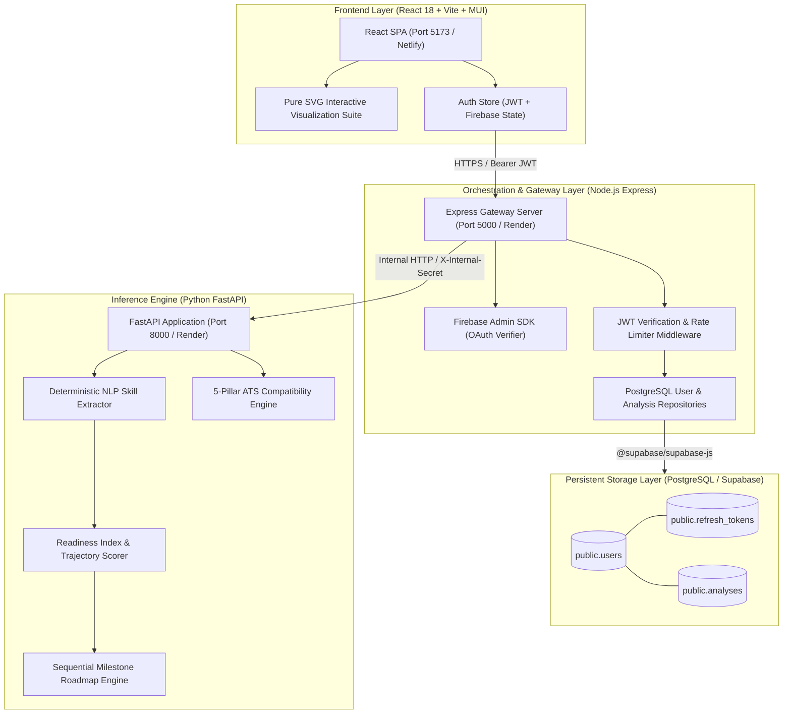
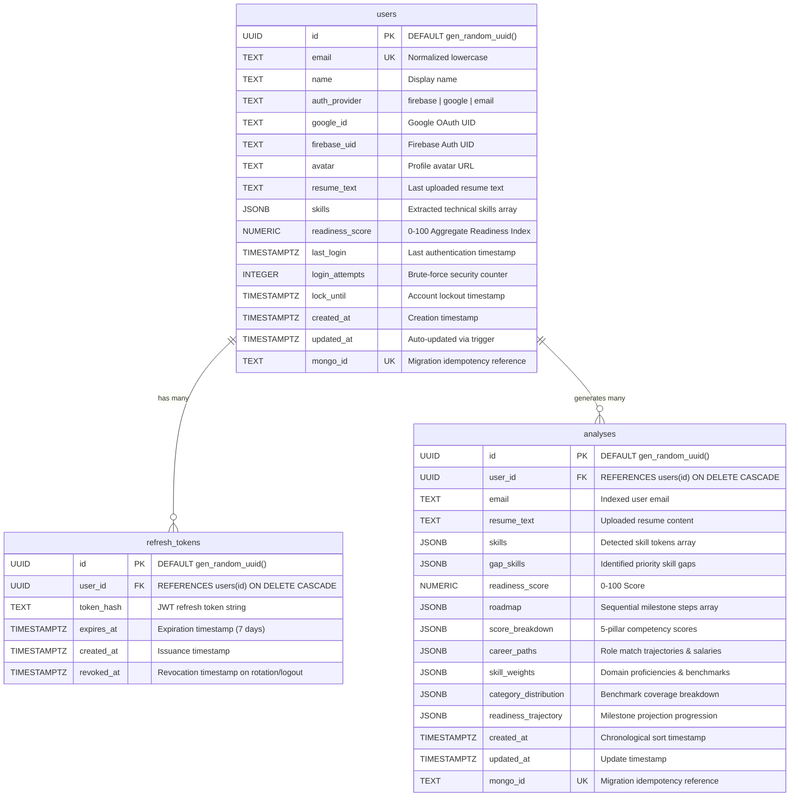
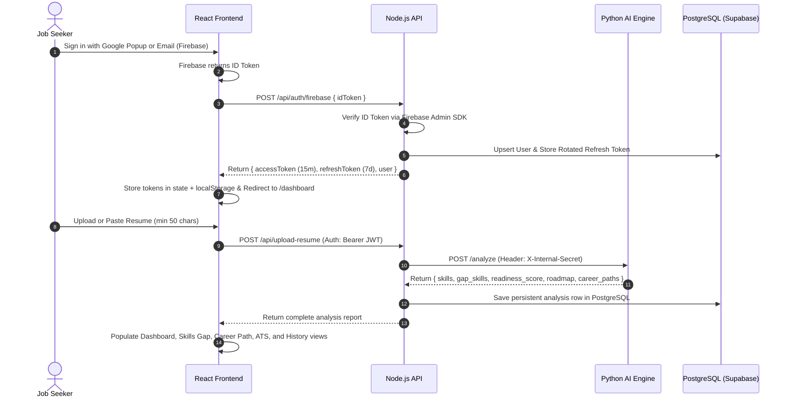

# ⚡ Futrix AI — Career Twin & Resume Intelligence Platform

<div align="center">


<p align="center">
  <b>Futrix AI</b> is an enterprise-grade Career Intelligence & Career Twin platform. It combines deterministic, non-hallucinatory NLP resume skill extraction, intelligent gap analysis, ATS compatibility auditing, interactive pure SVG analytics, sequential career roadmap generation, and predictive trajectory matching.
</p>

</div>

---

## 📑 Table of Contents
1. [System Architecture & Flows](#-system-architecture--flows)
2. [Database Architecture (PostgreSQL / Supabase)](#-database-architecture-postgresql--supabase)
3. [Key Features & Capabilities](#-key-features--capabilities)
4. [Interactive Pure SVG Visualizations](#-interactive-pure-svg-visualizations)
5. [End-to-End User Flow](#-end-to-end-user-flow)
6. [Security & Authentication](#-security--authentication)
7. [API Gateway Reference](#-api-gateway-reference)
8. [Local Development Setup](#-local-development-setup)
9. [Production Deployment Guide](#-production-deployment-guide)

---

## 🏛️ System Architecture & Flows

Futrix AI is organized as a three-tier distributed microservices monorepo designed for high throughput, strict security, and zero-hallucination NLP analysis.


```mermaid
flowchart TD
    subgraph ClientLayer ["Frontend Layer (React 18 + Vite + MUI)"]
        SPA["React SPA (Port 5173 / Netlify)"]
        Charts["Pure SVG Interactive Visualization Suite"]
        AuthStore["Auth Store (JWT + Firebase State)"]
    end

    subgraph GatewayLayer ["Orchestration & Gateway Layer (Node.js Express)"]
        NodeAPI["Express Gateway Server (Port 5000 / Render)"]
        FirebaseAuth["Firebase Admin SDK (OAuth Verifier)"]
        AuthGuard["JWT Verification & Rate Limiter Middleware"]
        UserRepo["PostgreSQL User & Analysis Repositories"]
    end

    subgraph DatabaseLayer ["Persistent Storage Layer (PostgreSQL / Supabase)"]
        UsersTable[("public.users")]
        TokensTable[("public.refresh_tokens")]
        AnalysesTable[("public.analyses")]
    end

    subgraph InferenceLayer ["Inference Engine (Python FastAPI)"]
        FastAPIServer["FastAPI Application (Port 8000 / Render)"]
        NLP["Deterministic NLP Skill Extractor"]
        ATS5["5-Pillar ATS Compatibility Engine"]
        Scorer["Readiness Index & Trajectory Scorer"]
        RoadmapGen["Sequential Milestone Roadmap Engine"]
    end

    SPA --> Charts
    SPA --> AuthStore
    AuthStore -- "HTTPS / Bearer JWT" --> NodeAPI
    NodeAPI --> FirebaseAuth
    NodeAPI --> AuthGuard
    AuthGuard --> UserRepo
    UserRepo -- "@supabase/supabase-js" --> DatabaseLayer
    UsersTable --- TokensTable
    UsersTable --- AnalysesTable
    NodeAPI -- "Internal HTTP / X-Internal-Secret" --> FastAPIServer
    FastAPIServer --> NLP
    FastAPIServer --> ATS5
    NLP --> Scorer
    Scorer --> RoadmapGen
```

---

## 🗄️ Database Architecture (PostgreSQL / Supabase)

The persistent database layer is powered by **PostgreSQL on Supabase** with relational integrity, cascading foreign keys, JSONB report indexing, and automated timestamp triggers.


```mermaid
erDiagram
    users ||--o{ refresh_tokens : "has many"
    users ||--o{ analyses : "generates many"

    users {
        UUID id PK "DEFAULT gen_random_uuid()"
        TEXT email UK "Normalized lowercase"
        TEXT name "Display name"
        TEXT auth_provider "firebase | google | email"
        TEXT google_id "Google OAuth UID"
        TEXT firebase_uid "Firebase Auth UID"
        TEXT avatar "Profile avatar URL"
        TEXT resume_text "Last uploaded resume text"
        JSONB skills "Extracted technical skills array"
        NUMERIC readiness_score "0-100 Aggregate Readiness Index"
        TIMESTAMPTZ last_login "Last authentication timestamp"
        INTEGER login_attempts "Brute-force security counter"
        TIMESTAMPTZ lock_until "Account lockout timestamp"
        TIMESTAMPTZ created_at "Creation timestamp"
        TIMESTAMPTZ updated_at "Auto-updated via trigger"
        TEXT mongo_id UK "Migration idempotency reference"
    }

    refresh_tokens {
        UUID id PK "DEFAULT gen_random_uuid()"
        UUID user_id FK "REFERENCES users(id) ON DELETE CASCADE"
        TEXT token_hash "JWT refresh token string"
        TIMESTAMPTZ expires_at "Expiration timestamp (7 days)"
        TIMESTAMPTZ created_at "Issuance timestamp"
        TIMESTAMPTZ revoked_at "Revocation timestamp on rotation/logout"
    }

    analyses {
        UUID id PK "DEFAULT gen_random_uuid()"
        UUID user_id FK "REFERENCES users(id) ON DELETE CASCADE"
        TEXT email "Indexed user email"
        TEXT resume_text "Uploaded resume content"
        JSONB skills "Detected skill tokens array"
        JSONB gap_skills "Identified priority skill gaps"
        NUMERIC readiness_score "0-100 Score"
        JSONB roadmap "Sequential milestone steps array"
        JSONB score_breakdown "5-pillar competency scores"
        JSONB career_paths "Role match trajectories & salaries"
        JSONB skill_weights "Domain proficiencies & benchmarks"
        JSONB category_distribution "Benchmark coverage breakdown"
        JSONB readiness_trajectory "Milestone projection progression"
        TIMESTAMPTZ created_at "Chronological sort timestamp"
        TIMESTAMPTZ updated_at "Update timestamp"
        TEXT mongo_id UK "Migration idempotency reference"
    }
```

### Relational Schema Summary:
- **`users` Table**: Central user account identity, Firebase/Google IDs, brute-force defense counters, and account lockout tracking.
- **`refresh_tokens` Table**: Long-lived JWT tokens with automatic rotation on refresh and single-session revocation on logout.
- **`analyses` Table**: Full persistent resume reports with JSONB structures for fast querying, chronological ordering (`created_at DESC`), and strict IDOR access isolation.

---

## ✨ Key Features & Capabilities

- **⚡ Deterministic NLP Skill Extraction**: Strict boundary regex matching across technical domains with zero LLM hallucination risk.
- **🎯 5-Pillar ATS Compatibility Checker**: Comprehensive audit evaluating layout safety, standard section presence, date parseability, keyword match, and text integrity.
- **📊 Interactive Pure SVG Analytics**: High-reliability SVG charts with dynamic cursor-following beams, glowing auras, and hover inspection cards.
- **🗺️ Sequential Career Roadmap**: Step-by-step milestone flowchart custom-tailored to bridge detected skill gaps.
- **💼 Target Role Fit Analysis**: Ranked alignment percentages and salary insights across prospective industry trajectories.
- **🔒 Enterprise-Grade Security**: Dual Firebase Admin token verification + rotated JWT session tokens, rate limiting, and IDOR protection.

---

## 📈 Interactive Pure SVG Visualizations

All data visualizations are custom-crafted in pure SVG for high reliability, zero layout collapsing, and smooth 60fps cursor interactions:

| Component | Location | Visual Capabilities |
| :--- | :--- | :--- |
| **`ScoreArea`** | Dashboard | Smooth monotone score progression curve with dynamic cursor-tracking line, milestone pulse dots, and score tooltips. |
| **`GapDonut`** | Dashboard / AI Analysis | Dual-arc SVG coverage gauge with center metric toggling between coverage % and gap % on hover. |
| **`SkillRadar`** | Dashboard / AI Analysis | 5-axis spider competency radar (`Frontend`, `Backend`, `Cloud Infra`, `DevOps / CI`, `Databases`) with magnetic spoke hover highlighting. |
| **`ATSBalanceRadar`** | ATS Checker | Pure SVG 5-pillar spider radar mapping parser safety, section headers, timeline dates, keywords, and encoding. |
| **`ATSPillarPerformance`** | ATS Checker | Pure SVG horizontal benchmark bars with 70% ATS standard passing threshold line and delta badges. |
| **`ATSScoreRing`** | ATS Checker | Radial SVG score gauge (0–100) with glowing color gradient and centered typography. |
| **`SkillDistribution`** | Skills Gap | Pure SVG 4-tier distribution bar chart (`Have`, `Critical`, `High`, `Medium`) with value labels and hover beams. |
| **`PriorityMatrix`** | Skills Gap | 2D Impact vs. Effort scatter matrix with collision-free alternating offsets and interactive inspection cards. |
| **`PureSVGHistoryChart`** | History | Pure SVG monotone trajectory progression curve across all saved historical evaluations. |
| **`RoadmapFlow`** | Career Path | Sequential SVG flowchart with active milestone glow and step numbering badges. |

---

## 🔄 End-to-End User Flow


```mermaid
sequenceDiagram
    autonumber
    actor User as Job Seeker
    participant SPA as React Frontend
    participant API as Node.js API
    participant AI as Python AI Engine
    participant DB as PostgreSQL (Supabase)

    %% Authentication Flow
    User->>SPA: Sign in with Google Popup or Email (Firebase)
    SPA->>SPA: Firebase returns ID Token
    SPA->>API: POST /api/auth/firebase { idToken }
    API->>API: Verify ID Token via Firebase Admin SDK
    API->>DB: Upsert User & Store Rotated Refresh Token
    API-->>SPA: Return { accessToken (15m), refreshToken (7d), user }
    SPA->>SPA: Store tokens in state + localStorage & Redirect to /dashboard

    %% Resume Analysis Flow
    User->>SPA: Upload or Paste Resume (min 50 chars)
    SPA->>API: POST /api/upload-resume (Auth: Bearer JWT)
    API->>AI: POST /analyze (Header: X-Internal-Secret)
    AI-->>API: Return { skills, gap_skills, readiness_score, roadmap, career_paths }
    API->>DB: Save persistent analysis row in PostgreSQL
    API-->>SPA: Return complete analysis report
    SPA->>SPA: Populate Dashboard, Skills Gap, Career Path, ATS, and History views
```

---

## 🛡️ Security & Authentication

- **Firebase Admin SDK**: Server-side token validation for Google Sign-In and email authentication.
- **Rotated Refresh Tokens**: 15-minute access tokens with 7-day refresh token rotation.
- **IDOR Cross-User Data Isolation**: History, report retrieval, and comparison endpoints are strictly scoped to the authenticated user's ID and email.
- **Strict Headers**: Configured Content Security Policy (CSP), Cross-Origin-Opener-Policy (`same-origin-allow-popups`), and CORS whitelist.
- **Service Isolation**: Python AI engine accepts requests only with a verified `X-Internal-Secret` header.

---

## 🚀 API Gateway Reference

### Authentication & User Management
- `POST /api/auth/firebase` — Exchange Firebase ID token for JWT session pair.
- `POST /api/auth/refresh` — Rotate and issue a new access token.
- `POST /api/auth/logout` — Revoke active refresh token on server.
- `POST /api/login` — Direct email authentication.
- `GET  /api/auth/verify` — Verify active access token.
- `GET  /api/profile` — Fetch authenticated user profile and stats.
- `PUT  /api/profile` — Update user profile details.

### Resume Intelligence & Analysis
- `POST /api/upload-resume` — Analyze resume text, extract skills, calculate readiness index, and generate roadmap.
- `POST /api/ats-check` — Perform 5-pillar ATS compatibility check.
- `POST /api/jobs/match` — Match detected skillset against database of tech roles.
- `GET  /api/history` — Retrieve authenticated user's analysis history (`created_at DESC`).
- `GET  /api/compare` — Compare two analysis documents with IDOR verification and delta computation.

---

## 💻 Local Development Setup

### Prerequisites
- Node.js 18+
- Python 3.10+
- Supabase Project (or built-in local in-memory relational store)

### 1. Python AI Engine
```bash
cd python-ai
python -m venv venv
# Windows:
.\venv\Scripts\activate
# Unix/macOS:
source venv/bin/activate
pip install -r requirements.txt
uvicorn main:app --host 0.0.0.0 --port 8000 --reload
```

### 2. Node.js Backend API
```bash
cd node-api
npm install
npm run dev
```

### 3. React Frontend Client
```bash
cd client
npm install
npm run dev
```

The client will be running on `http://localhost:5173`.

---

## 🌐 Production Deployment Guide

### 1. Deploy Python AI Engine to Render
- **Root Directory**: `python-ai`
- **Build Command**: `pip install -r requirements.txt`
- **Start Command**: `uvicorn main:app --host 0.0.0.0 --port $PORT`
- **Environment Variables**:
  - `PYTHON_VERSION=3.11.0`
  - `ALLOWED_ORIGINS=https://futrixai.netlify.app,https://futrix-node-api.onrender.com`
  - `INTERNAL_API_SECRET=your_secure_secret`

### 2. Deploy Node.js API to Render
- **Root Directory**: `node-api`
- **Build Command**: `npm install`
- **Start Command**: `node server.js`
- **Environment Variables**:
  - `NODE_ENV=production`
  - `SUPABASE_URL=https://your-project.supabase.co`
  - `SUPABASE_SERVICE_ROLE_KEY=your_supabase_service_role_key`
  - `JWT_SECRET=your_jwt_secret`
  - `JWT_REFRESH_SECRET=your_jwt_refresh_secret`
  - `PYTHON_URL=https://futrix-python-ai.onrender.com`
  - `INTERNAL_API_SECRET=your_secure_secret`
  - `CLIENT_URL=https://futrixai.netlify.app`
  - `FIREBASE_SERVICE_ACCOUNT={"type":"service_account",...}`

### 3. Deploy Frontend Client to Netlify
- **Base Directory**: `client`
- **Build Command**: `npm install && npm run build`
- **Publish Directory**: `dist`
- **Environment Variables**:
  - `NODE_VERSION=18`
  - `VITE_API_URL=https://futrix-node-api.onrender.com`
  - `VITE_GOOGLE_CLIENT_ID=your_google_client_id`

---

<div align="center">
  <sub>Built with precision by the Futrix AI Team.</sub>
</div>
