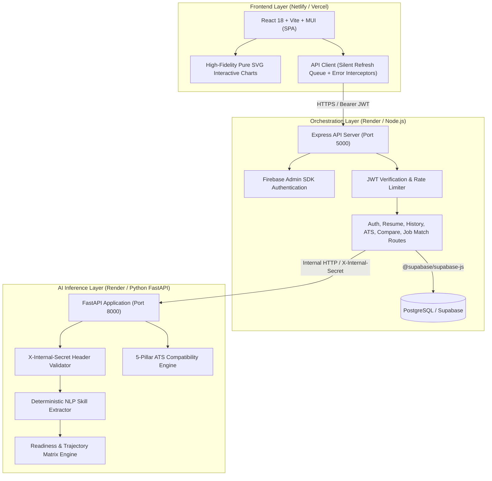
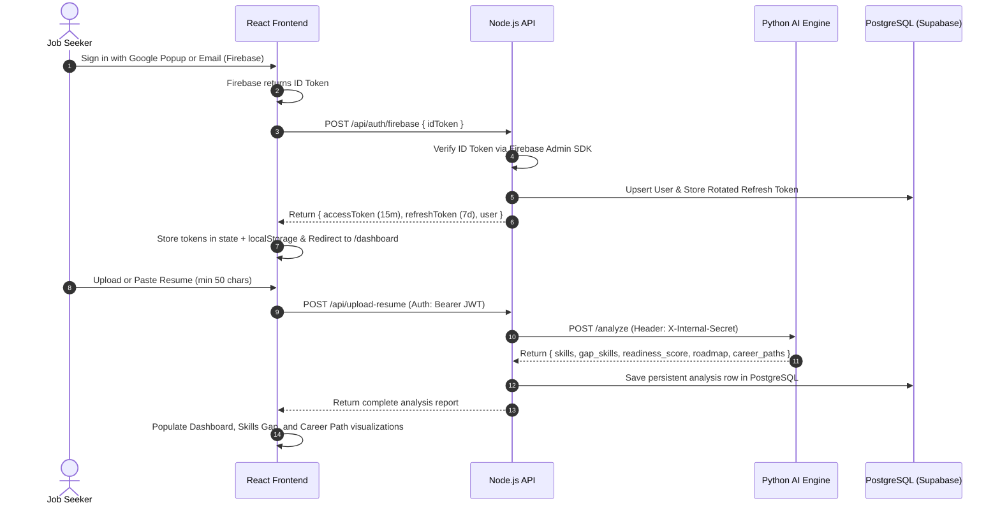

# ⚡ Futrix AI — Career Twin & Resume Intelligence Platform

<div align="center">


<p align="center">
  <b>Futrix AI</b> is an enterprise-grade Career Intelligence & Career Twin platform. It combines deterministic, non-hallucinatory NLP resume skill extraction, intelligent gap analysis, ATS compatibility auditing, interactive SVG analytics, sequential career roadmap generation, and predictive trajectory matching.
</p>

</div>

---

## 📑 Table of Contents
1. [System Architecture](#-system-architecture)
2. [Key Features](#-key-features)
3. [Interactive Data Visualizations](#-interactive-data-visualizations)
4. [End-to-End User Flow](#-end-to-end-user-flow)
5. [Database Schema & Migration](#-database-schema--migration)
6. [Security & Authentication](#-security--authentication)
7. [API Reference](#-api-reference)
8. [Local Development Setup](#-local-development-setup)
9. [Production Deployment Guide](#-production-deployment-guide)

---

## 🏛️ System Architecture

Futrix AI is organized as a three-tier distributed microservices monorepo designed for high throughput, strict security, and zero-hallucination NLP analysis.


```mermaid
flowchart TD
    subgraph Client ["Frontend Layer (Netlify / Vercel)"]
        UI["React 18 + Vite + MUI (SPA)"]
        Charts["High-Fidelity Pure SVG Interactive Charts"]
        Axios["API Client (Silent Refresh Queue + Error Interceptors)"]
    end

    subgraph Gateway ["Orchestration Layer (Render / Node.js)"]
        NodeServer["Express API Server (Port 5000)"]
        FirebaseSDK["Firebase Admin SDK Authentication"]
        AuthMiddleware["JWT Verification & Rate Limiter"]
        UserRouter["Auth, Resume, History, ATS, Compare, Job Match Routes"]
        Postgres[("PostgreSQL / Supabase")]
    end

    subgraph Engine ["AI Inference Layer (Render / Python FastAPI)"]
        FastAPIServer["FastAPI Application (Port 8000)"]
        InternalAuth["X-Internal-Secret Header Validator"]
        NLP["Deterministic NLP Skill Extractor"]
        ATS["5-Pillar ATS Compatibility Engine"]
        Scorer["Readiness & Trajectory Matrix Engine"]
    end

    UI --> Charts
    UI --> Axios
    Axios -- "HTTPS / Bearer JWT" --> NodeServer
    NodeServer --> FirebaseSDK
    NodeServer --> AuthMiddleware
    AuthMiddleware --> UserRouter
    UserRouter -- "@supabase/supabase-js" --> Postgres
    UserRouter -- "Internal HTTP / X-Internal-Secret" --> FastAPIServer
    FastAPIServer --> InternalAuth
    InternalAuth --> NLP
    NLP --> Scorer
    FastAPIServer --> ATS
```

---

## ✨ Key Features

- **⚡ Deterministic Skill Extraction**: Strict boundary regex matching across technical domains with zero LLM hallucination risk.
- **🎯 5-Pillar ATS Checker**: Comprehensive audit evaluating formatting risk, essential section presence, date parseability, keyword match, and text integrity.
- **📊 Interactive Data Visualizations**: High-reliability SVG charts with dynamic cursor-following beams, glowing auras, and hover inspection cards.
- **🗺️ Sequential Career Roadmap**: Step-by-step milestone flowchart custom-tailored to bridge detected skill gaps.
- **💼 Target Role Fit Analysis**: Ranked alignment percentages and salary insights across industry trajectories.
- **🔒 Enterprise-Grade Security**: Dual Firebase Admin token verification + rotated JWT session tokens, rate limiting, and IDOR protection.

---

## 📈 Interactive Data Visualizations

| Chart Component | Location | Description & Capabilities |
| :--- | :--- | :--- |
| **`ScoreArea`** | Dashboard | Smooth monotone score progression curve with dynamic cursor-tracking line, milestone pulse dots, and score tooltips. |
| **`GapDonut`** | Dashboard / AI Analysis | Dual-arc SVG coverage gauge with center metric toggling between coverage % and gap % on hover. |
| **`SkillRadar`** | Dashboard / AI Analysis | 5-axis spider competency radar (`Frontend`, `Backend`, `Cloud Infra`, `DevOps / CI`, `Databases`) with magnetic spoke hover highlighting. |
| **`SkillDistribution`** | Skills Gap | Pure SVG 4-tier distribution bar chart (`Have`, `Critical`, `High`, `Medium`) with value labels and hover beams. |
| **`PriorityMatrix`** | Skills Gap | 2D Impact vs. Effort scatter matrix with collision-free alternating offsets and interactive inspection cards. |
| **`RoadmapFlow`** | Career Path | Sequential SVG flowchart with active milestone glow and step numbering badges. |
| **`RoleComparisonChart`**| Career Path | Ranked horizontal comparison bar chart across prospective engineering roles. |

---

## 🔄 End-to-End User Flow


```mermaid
sequenceDiagram
    autonumber
    actor User as Job Seeker
    participant SPA as React Frontend
    participant API as Node.js API
    participant AI as Python AI Engine
    participant DB as PostgreSQL (Supabase)

    %% Auth Flow
    User->>SPA: Sign in with Google Popup or Email (Firebase)
    SPA->>SPA: Firebase returns ID Token
    SPA->>API: POST /api/auth/firebase { idToken }
    API->>API: Verify ID Token via Firebase Admin SDK
    API->>DB: Upsert User & Store Rotated Refresh Token
    API-->>SPA: Return { accessToken (15m), refreshToken (7d), user }
    SPA->>SPA: Store tokens in state + localStorage & Redirect to /dashboard

    %% Resume Analysis Flow
    User->>SPA: Upload or Paste Resume (min 50 chars)
    SPA->>API: POST /api/upload-resume (Auth: Bearer JWT)
    API->>AI: POST /analyze (Header: X-Internal-Secret)
    AI-->>API: Return { skills, gap_skills, readiness_score, roadmap, career_paths }
    API->>DB: Save persistent analysis row in PostgreSQL
    API-->>SPA: Return complete analysis report
    SPA->>SPA: Populate Dashboard, Skills Gap, and Career Path visualizations
```

---

## 🗄️ Database Schema & Migration

Futrix AI uses PostgreSQL on **Supabase** with a relational schema and JSONB support for nested report analytics:
- **`users`**: Account identity, OAuth provider UIDs, login attempts, and account lockout tracking.
- **`refresh_tokens`**: Long-lived JWT tokens for secure rotation and single-session revocation.
- **`analyses`**: Full resume report documents, skills, gap arrays, trajectory matrices, and scores.

For migration from MongoDB Atlas to Supabase, refer to the [Migration Guide (MIGRATION.md)](file:///d:/Projects/Futrix-Ai/Futrix-Ai/MIGRATION.md) and execute:
```bash
node node-api/scripts/migrate-to-supabase.js --dry-run
```

---

## 🛡️ Security & Authentication

- **Firebase Admin SDK**: Server-side token validation for Google Sign-In and email authentication.
- **Rotated Refresh Tokens**: 15-minute access tokens with 7-day refresh token rotation.
- **Strict Headers**: Configured Content Security Policy (CSP), Cross-Origin-Opener-Policy (`same-origin-allow-popups`), and CORS whitelist.
- **Service Isolation**: Python AI engine accepts requests only with a verified `X-Internal-Secret` header.

---

## 🚀 API Reference

### Authentication & User Management
- `POST /api/auth/firebase` — Exchange Firebase ID token for JWT session pair.
- `POST /api/auth/refresh` — Rotate and issue a new access token.
- `POST /api/login` — Direct email authentication.
- `GET  /api/profile` — Fetch authenticated user profile and stats.

### Resume & Career Intelligence
- `POST /api/upload-resume` — Analyze resume text, extract skills, calculate score, and generate roadmap.
- `POST /api/ats-check` — Perform 5-pillar ATS compatibility check.
- `POST /api/jobs/match` — Match detected skillset against database of tech roles.
- `GET  /api/history` — Retrieve authenticated user's analysis history.
- `GET  /api/compare` — Compare two analysis documents with IDOR verification.

---

## 💻 Local Development Setup

### Prerequisites
- Node.js 18+
- Python 3.10+
- Supabase Project or local in-memory fallback

### 1. Python AI Engine
```bash
cd python-ai
python -m venv venv
# Windows:
.\venv\Scripts\activate
# Unix/macOS:
source venv/bin/activate
pip install -r requirements.txt
uvicorn main:app --host 0.0.0.0 --port 8000 --reload
```

### 2. Node.js Backend API
```bash
cd node-api
npm install
npm run dev
```

### 3. React Frontend Client
```bash
cd client
npm install
npm run dev
```

The client will be running on `http://localhost:5173`.

---

## 🌐 Production Deployment Guide

### 1. Deploy Python AI Engine to Render
- **Root Directory**: `python-ai`
- **Build Command**: `pip install -r requirements.txt`
- **Start Command**: `uvicorn main:app --host 0.0.0.0 --port $PORT`
- **Environment Variables**:
  - `PYTHON_VERSION=3.11.0`
  - `ALLOWED_ORIGINS=https://futrixai.netlify.app,https://futrix-node-api.onrender.com`
  - `INTERNAL_API_SECRET=your_secure_secret`

### 2. Deploy Node.js API to Render
- **Root Directory**: `node-api`
- **Build Command**: `npm install`
- **Start Command**: `node server.js`
- **Environment Variables**:
  - `NODE_ENV=production`
  - `SUPABASE_URL=https://your-project.supabase.co`
  - `SUPABASE_SERVICE_ROLE_KEY=your_supabase_service_role_key`
  - `JWT_SECRET=your_jwt_secret`
  - `JWT_REFRESH_SECRET=your_jwt_refresh_secret`
  - `PYTHON_URL=https://futrix-python-ai.onrender.com`
  - `INTERNAL_API_SECRET=your_secure_secret`
  - `CLIENT_URL=https://futrixai.netlify.app`
  - `FIREBASE_SERVICE_ACCOUNT={"type":"service_account",...}`

### 3. Deploy Frontend Client to Netlify
- **Base Directory**: `client`
- **Build Command**: `npm install && npm run build`
- **Publish Directory**: `dist`
- **Environment Variables**:
  - `NODE_VERSION=18`
  - `VITE_API_URL=https://futrix-node-api.onrender.com`
  - `VITE_GOOGLE_CLIENT_ID=your_google_client_id`

---

<div align="center">
  <sub>Built with precision by the Futrix AI Team.</sub>
</div>
