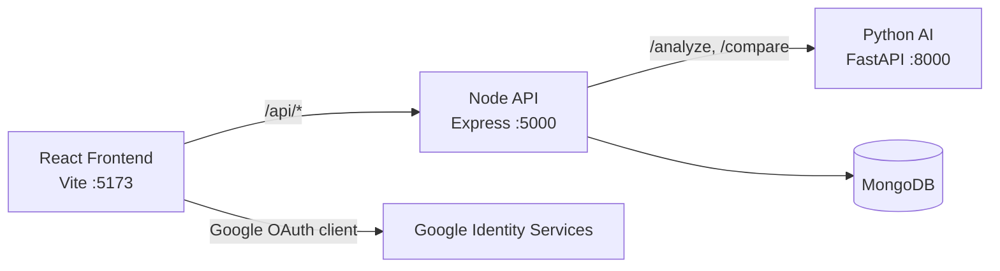
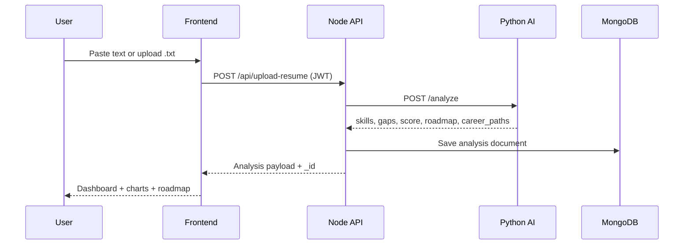
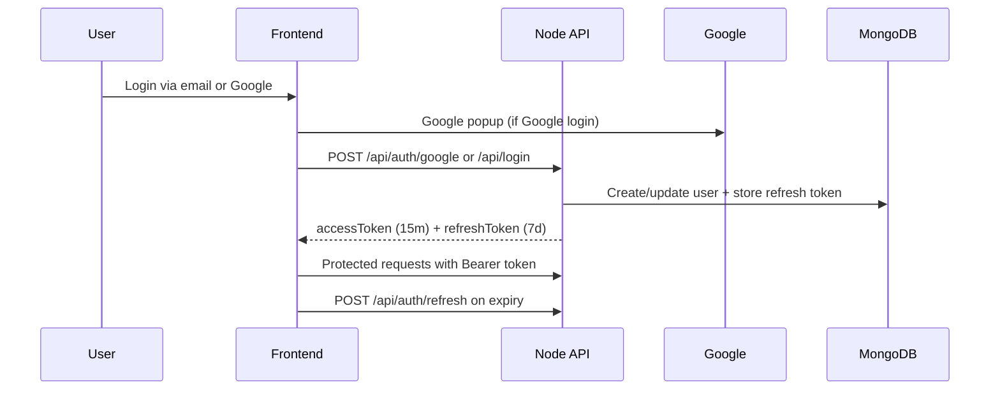

# Futrix AI - Career Twin

AI-powered resume analysis platform with deterministic skill extraction, readiness scoring, gap detection, and career path matching.

## 1) What this project actually is

Futrix AI is a **monorepo** with three active runtime services:

1. **Frontend (`client/`)** - React + TypeScript app (Vite + MUI)
2. **Node API (`node-api/`)** - Express API for auth, persistence, and orchestration
3. **Python AI (`python-ai/`)** - FastAPI engine for resume analysis logic

There is also a **legacy Java gateway (`java-gateway/`)** included in the repo and in Docker compose, but the current primary auth + API flow is Node-based.

---

## 2) High-level architecture (visual)


```mermaid
flowchart LR
    A[React Frontend<br/>Vite :5173] -->|/api/*| B[Node API<br/>Express :5000]
    B -->|/analyze, /compare| C[Python AI<br/>FastAPI :8000]
    B --> D[(MongoDB)]
    A -->|Google OAuth client| E[Google Identity Services]
```

### Runtime responsibilities

- **Frontend**: login UX, resume upload/paste, dashboards/charts, route protection
- **Node API**: JWT auth, Google token verification, refresh rotation, rate limiting, stores analysis history
- **Python AI**: deterministic skill detection against a skills database, scoring, gap logic, role matching

---

## 3) Feature flow (visual + practical)

### Resume analysis flow


```mermaid
sequenceDiagram
    participant U as User
    participant FE as Frontend
    participant API as Node API
    participant AI as Python AI
    participant DB as MongoDB

    U->>FE: Paste text or upload .txt
    FE->>API: POST /api/upload-resume (JWT)
    API->>AI: POST /analyze
    AI-->>API: skills, gaps, score, roadmap, career_paths
    API->>DB: Save analysis document
    API-->>FE: Analysis payload + _id
    FE-->>U: Dashboard + charts + roadmap
```

### Auth flow


```mermaid
sequenceDiagram
    participant U as User
    participant FE as Frontend
    participant API as Node API
    participant G as Google
    participant DB as MongoDB

    U->>FE: Login via email or Google
    FE->>G: Google popup (if Google login)
    FE->>API: POST /api/auth/google or /api/login
    API->>DB: Create/update user + store refresh token
    API-->>FE: accessToken (15m) + refreshToken (7d)
    FE->>API: Protected requests with Bearer token
    FE->>API: POST /api/auth/refresh on expiry
```

---

## 4) Core analysis behavior (from current code)

### Deterministic extraction
- Uses `python-ai/skills_db.json` with **170 known skills**.
- No LLM calls in the analysis pipeline.
- Boundary-aware matching for ambiguous short skills like `Go`, `AI`, `R`, `C`, `C#`, `C++`, `SQL`.

### Scoring logic
- Base score from number of detected skills
- Penalty from number of gaps
- Score clamped to valid range
- Additional score breakdown dimensions:
  - skill_match
  - stack_balance
  - cloud_presence
  - devops_score
  - language_div

### Gap and roadmap logic
- Gap suggestions are context-aware (frontend/backend/devops/cloud/ml domains).
- Roadmap is generated from actual identified gaps, plus portfolio/interview prompts when enough skills exist.

---

## 5) UI/UX behavior users get

### Key pages
- `/login` - Google OAuth + email login
- `/upload` - Paste resume text or upload `.txt`
- `/dashboard` - score summary and visual metrics
- `/result` - detailed report
- `/skills-gap` - missing skills visualization
- `/career-path` - role match mapping
- `/history` - saved analysis history
- `/profile` - user profile view

### Upload behavior
- Supports:
  - manual text paste
  - drag-and-drop `.txt`
  - file picker upload `.txt`
- Enforces minimum content threshold (50 chars) before analysis.

---

## 6) API surface (current)

### Node API (`/api`)

| Method | Endpoint | Auth | Purpose |
|---|---|---|---|
| POST | `/login` | No | Email login |
| POST | `/auth/google` | No | Google credential verification |
| POST | `/auth/refresh` | No | Refresh token rotation |
| POST | `/auth/logout` | No | Invalidate stored refresh token |
| GET | `/auth/verify` | Yes | Verify access token + return user |
| POST | `/upload-resume` | Yes | Analyze and save resume |
| GET | `/history` | Yes | Fetch recent analyses |
| GET | `/compare?id1=&id2=` | Yes | Compare two analysis entries |
| POST | `/jobs/match` | Yes | Role matching from skill list |
| GET | `/health` | No | Service health |

### Python AI

| Method | Endpoint | Purpose |
|---|---|---|
| GET | `/` | engine status |
| GET | `/health` | health |
| POST | `/analyze` | full analysis |
| POST | `/score-breakdown` | score components |
| POST | `/career-path` | role mapping |
| POST | `/compare` | compare two resumes |

---

## 7) Repository structure

```text
career-twin-ai/
├─ client/                 # React + TypeScript frontend
│  ├─ src/
│  │  ├─ pages/
│  │  ├─ components/
│  │  ├─ services/
│  │  └─ store/
│  ├─ vite.config.ts
│  ├─ netlify.toml
│  └─ vercel.json
├─ node-api/               # Express API + Mongo models
│  ├─ routes/userRoutes.js
│  ├─ middleware/
│  ├─ models/
│  ├─ utils/
│  ├─ server.js
│  └─ render.yaml
├─ python-ai/              # FastAPI analysis engine
│  ├─ main.py
│  ├─ ai_engine.py
│  ├─ skills_db.json
│  └─ render.yaml
├─ java-gateway/           # legacy Java servlet gateway (optional)
├─ docker-compose.yml
├─ run-dev.bat
└─ render.yaml
```

---

## 8) Local development (practical runbook)

## Prerequisites
1. Node.js 18+
2. Python 3.11+
3. MongoDB (local or Atlas)

## Option A - one command from root

```bash
npm install
npm run dev
```

This runs:
- Python AI on `http://localhost:8000`
- Node API on `http://localhost:5000`
- React frontend on `http://localhost:5173`

## Option B - Windows helper script

```bat
run-dev.bat
```

Opens separate terminals for all services and browser.

## Option C - start services manually

```bash
# terminal 1
cd python-ai
pip install -r requirements.txt
uvicorn main:app --reload --port 8000

# terminal 2
cd node-api
npm install
node server.js

# terminal 3
cd client
npm install
npm run dev
```

---

## 9) Environment variables

### `node-api/.env`

```env
MONGO_URI=mongodb://localhost:27017/futrixai
PORT=5000
NODE_ENV=development
PYTHON_URL=http://localhost:8000
FRONTEND_URL=http://localhost:5173
JWT_SECRET=replace_with_secure_value
JWT_REFRESH_SECRET=replace_with_secure_value
GOOGLE_CLIENT_ID=your_google_client_id
GOOGLE_CLIENT_SECRET=your_google_client_secret
```

### `client/.env`

```env
VITE_GOOGLE_CLIENT_ID=your_google_client_id
VITE_API_URL=http://localhost:5000
```

---

## 10) Deployment reality in this repo

The repo includes multiple deployment configs:

- **Netlify** (`netlify.toml`, `client/netlify.toml`)
- **Vercel** (`client/vercel.json`, `node-api/vercel.json`)
- **Render** (`render.yaml`, `node-api/render.yaml`, `python-ai/render.yaml`)

Most recent production flow in code/docs is:
- Frontend: Netlify or Vercel static deployment
- Node API: Render or Vercel
- Python AI: Render

---

## 11) Operational notes and troubleshooting

## 1. Google OAuth origin errors (403)
- Ensure exact frontend origins are in Google OAuth Authorized JavaScript origins.
- Local commonly needed:
  - `http://localhost:5173`
  - `http://127.0.0.1:5173`

## 2. COOP warning in console
- Current configs already use:
  - `Cross-Origin-Opener-Policy: same-origin-allow-popups`
  - `Cross-Origin-Embedder-Policy: unsafe-none`
- If login succeeds, occasional warning logs may still appear and are typically non-blocking.

## 3. Token "too far in future"
- Usually system clock drift on machine/server.
- Sync OS time and retry Google sign-in.

## 4. AI analysis delays
- Free tier cold starts can delay first call.
- Upload UI already communicates wake-up behavior.

## 5. Port conflicts
- Frontend is configured with strict `5173`; if occupied, free that port first.

---

## 12) Tech stack

### Frontend
- React 18
- TypeScript 5
- Vite 5
- MUI 7
- Zustand
- Recharts
- Framer Motion + GSAP
- `@react-oauth/google`

### Node API
- Node.js + Express 5
- Mongoose
- JWT (`jsonwebtoken`)
- Google Auth Library
- CORS + custom rate limiter

### Python AI
- FastAPI
- Pydantic
- Uvicorn
- deterministic text analysis engine

---

## 13) Security model

- Access token + refresh token architecture
- Access token verified on protected routes
- Refresh token stored per-user in MongoDB and rotated
- Rate limiting on login and critical endpoints
- CORS allowlist with localhost + deployed domains

---

## 14) License

MIT

